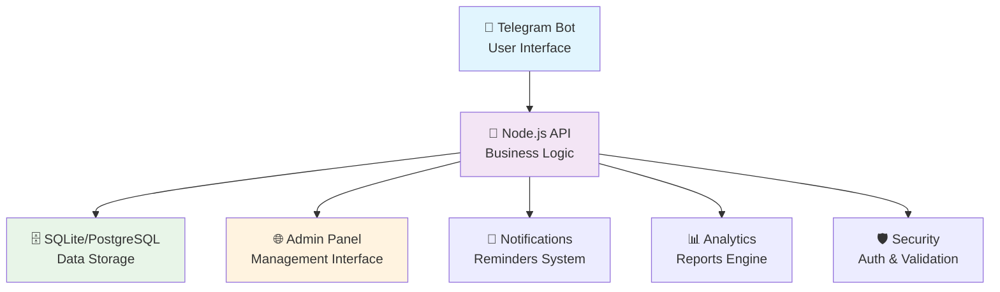

# 🤖 Outcast TimeBot v4.0

> **Профессиональная система учёта рабочего времени через Telegram с современным UI/UX**

Полнофункциональная система управления рабочим временем с Telegram-ботом, веб админ-панелью и аналитикой. Включает защиту от ошибок пользователей, дружественные сообщения и автоматизированную отчётность.

---

## 🎯 Основные возможности

### 📱 Для сотрудников (Telegram бот):
- ✅ **Отметка времени**: Приход (офис/удалённо), обед, уход
- 📝 **Ежедневные отчёты**: Автоматический запрос после завершения дня
- 📊 **Статистика**: День (`/myday`), неделя (`/myweek`), история (`/history`)
- 🔒 **Защита от ошибок**: Валидация действий и защита от спама
- 🤒 **Больничные и отпуска**: Простая отметка нерабочих дней
- 💬 **Дружественный интерфейс**: Понятные сообщения и подсказки

### 👑 Для менеджеров:
- 👥 **Команда в реальном времени**: `/team` - статус всех сотрудников
- 📈 **Аналитика команды**: Кто работает, на обеде, опаздывает
- 📊 **Еженедельные сводки**: Автоматическая статистика по команде

### ⚙️ Для администраторов (Web-панель):
- 👥 **Управление пользователями**: Создание, редактирование, роли
- 📈 **Полная аналитика**: Графики, тренды, детализация
- 📄 **Экспорт отчётов**: Excel, PDF с фильтрами
- 🎯 **Рейтинг надёжности**: Автоматический расчёт по метрикам
- ⚙️ **Редактирование данных**: Корректировка времени и отчётов
- 🔍 **Аудит действий**: Полный журнал изменений

---

## 🚀 Быстрый старт

### 📋 Предварительные требования

- **Node.js** 18+ 
- **PostgreSQL** 12+ (или SQLite для разработки)
- **Telegram Bot Token** от @BotFather

### 🔧 1. Установка и настройка

```bash
# Клонирование репозитория
git clone <your-repo-url>
cd hr-timebot

# Установка зависимостей
npm install

# Настройка окружения
cp env.example .env
# ⚠️ ОБЯЗАТЕЛЬНО заполните переменные в .env файле!

# Инициализация базы данных
npm run migrate
npm run seed

# Запуск backend
npm start
```

### 🌐 2. Запуск Admin Panel

```bash
# Переход в папку админ-панели
cd admin-panel

# Установка зависимостей
npm install

# Запуск веб-админки
npm run dev
```

### 🔑 3. Первый вход

- **🌐 Admin Panel:** http://localhost:5173
- **🔐 Логин:** `admin` / `admin123`
- **🤖 Telegram Bot:** Найдите своего бота и отправьте `/start`

---

## ⚙️ Конфигурация

### 🔐 Backend (.env)
```env
# 🗄️ База данных
DB_HOST=localhost
DB_PORT=5432
DB_NAME=outcast_timebot
DB_USER=postgres
DB_PASSWORD=your_password

# 🤖 Telegram Bot
TELEGRAM_BOT_TOKEN=your_bot_token_here

# 🔐 Безопасность
JWT_SECRET=your_super_secret_jwt_key_here

# 👤 Админ доступ
ADMIN_USERNAME=admin
ADMIN_PASSWORD=admin123

# 🚀 Среда выполнения
NODE_ENV=production
PORT=3000
```

### 🌐 Admin Panel (admin-panel/.env)
```env
VITE_API_URL=http://localhost:3000/api
```

---

## 🤖 Команды Telegram бота

### 📞 Основные команды

| Команда | Описание | Доступ |
|---------|----------|--------|
| `/start` | 🚀 Регистрация и главное меню | Все |
| `/myday` | 📊 Статистика за сегодня | Все |
| `/myweek` | 📈 Детальная сводка за неделю | Все |
| `/history` | 📚 История за последние 30 дней | Все |
| `/team` | 👥 Статус команды в реальном времени | Менеджеры+ |
| `/editreport` | ✏️ Редактирование отчёта за сегодня | Все |
| `/cancel` | ❌ Отмена текущей операции | Все |
| `/help` | 📖 Подробная справка | Все |

### 🎛️ Интерактивные кнопки

| Кнопка | Действие | Когда доступно |
|--------|----------|----------------|
| ✅ **Пришёл в офис** | Отметка прихода в офис | В начале дня |
| 🏠 **Работаю удалённо** | Отметка удалённой работы | В начале дня |
| 🍱 **Начал обед** | Начало обеденного перерыва | После прихода |
| 🔙 **Вернулся с обеда** | Возвращение с обеда | Во время обеда |
| ❌ **Ушёл домой** | Завершение дня + запрос отчёта | В конце дня |
| 🤒 **Больничный** | Отметка болезни | Всегда |

---

## 🔄 Рабочий процесс

### 📅 Типичный рабочий день:

1. **🌅 Утром**: Отправьте `/start` → Выберите "Пришёл в офис" или "Работаю удалённо"
2. **🍽️ Обед**: "Начал обед" → "Вернулся с обеда" (опционально)
3. **🌆 Вечером**: "Ушёл домой" → Напишите отчёт о проделанной работе
4. **📊 Статистика**: `/myday`, `/myweek` - просмотр своей статистики

### 👨‍💼 Для менеджеров:

- **👥 Команда**: `/team` - видеть кто сейчас работает, на обеде, опаздывает
- **📈 Аналитика**: Доступ к веб админ-панели для глубокой аналитики

---

## 🏗️ Архитектура системы



### 🧩 Компоненты:

- **🤖 Telegram Bot**: Интерфейс для сотрудников
- **🌐 Node.js API**: Бизнес-логика и обработка данных
- **🗄️ База данных**: Хранение пользователей и рабочих логов
- **📱 Admin Panel**: Веб-интерфейс для управления
- **🔔 Система уведомлений**: Автоматические напоминания
- **📊 Аналитика**: Генерация отчётов и статистики

---

## 🛡️ Безопасность и защита

### 🔒 Реализованные меры:

- ✅ **Защита от спама**: Cooldown на все действия (1-3 сек)
- ✅ **Валидация действий**: Невозможно выполнить нелогичные операции
- ✅ **JWT авторизация**: Безопасный доступ к админ-панели
- ✅ **Rate limiting**: Защита API от перегрузки
- ✅ **SQL-инъекции**: Защита через ORM Sequelize
- ✅ **Аудит действий**: Логирование всех изменений
- ✅ **Дружественные ошибки**: Никаких технических деталей пользователям

### 🔐 Роли и права:

| Роль | Права |
|------|-------|
| **employee** | Отметка времени, просмотр своей статистики |
| **manager** | + просмотр команды, базовая аналитика |
| **admin** | + полный доступ к админ-панели, управление пользователями |

---

## 📊 API Эндпоинты

### 🔐 Авторизация
- `POST /api/auth/login` - Вход в админ-панель
- `GET /api/auth/verify` - Проверка токена

### 👥 Пользователи
- `GET /api/users` - Список всех пользователей
- `GET /api/users/:id` - Профиль пользователя
- `PUT /api/users/:id` - Обновление данных
- `DELETE /api/users/:id` - Деактивация
- `GET /api/users/:id/stats` - Персональная статистика
- `GET /api/users/ranking/reliability` - Рейтинг надёжности

### 📈 Рабочие логи
- `GET /api/work-logs` - Список с фильтрами
- `GET /api/work-logs/stats` - Статистика за период
- `GET /api/work-logs/team/today` - Команда сегодня
- `PUT /api/work-logs/:id` - Редактирование
- `DELETE /api/work-logs/:id` - Удаление

### 📄 Отчёты
- `POST /api/reports/excel` - Excel отчёт
- `POST /api/reports/pdf` - PDF отчёт
- `GET /api/reports/analytics` - Данные для графиков

---

## 🎯 Система рейтингов

### 📊 Рейтинг надёжности сотрудника

**Базовый балл:** 100 ⭐

#### 📉 Штрафы:
- **⏰ Опоздания** (после 9:00): до -30 баллов
- **📝 Отсутствие отчётов**: до -25 баллов  
- **⏱️ Недоработка** (< 7 часов): до -20 баллов
- **🏃 Ранний уход** (до 17:00): до -15 баллов

#### 📈 Бонусы:
- **💪 Переработка** (> 8 часов): до +15 баллов
- **📋 Качественные отчёты**: до +10 баллов
- **🎯 Стабильность**: до +5 баллов

### 🏆 Категории рейтинга:
- **🥇 90-100**: Отличный сотрудник
- **🥈 70-89**: Хороший сотрудник  
- **🥉 50-69**: Удовлетворительно
- **⚠️ 0-49**: Требует внимания

---

## 📦 Развёртывание в продакшн

### 🐳 Docker (рекомендуется)

```bash
# Сборка образа
docker build -t outcast-timebot .

# Запуск с Docker Compose
docker-compose up -d

# Просмотр логов
docker-compose logs -f
```

### 🔄 PM2 (альтернатива)

```bash
# Установка PM2
npm install -g pm2

# Запуск приложения
pm2 start index.js --name "timebot"

# Автозапуск при перезагрузке
pm2 startup
pm2 save

# Мониторинг
pm2 monit
```

### ☁️ Cloud Deployment

#### Vercel (Frontend + API):
```bash
# Деплой админ-панели
cd admin-panel
vercel --prod

# Деплой API (serverless)
vercel --prod
```

#### Railway/Heroku (Fullstack):
```bash
# Подключение к Railway
railway login
railway link
railway up
```

---

## 🔍 Мониторинг и отладка

### 🩺 Health Check
```bash
curl http://localhost:3000/health
```

### 📋 Логи
```bash
# PM2 логи
pm2 logs timebot

# Docker логи
docker-compose logs -f

# Файловые логи
tail -f logs/app.log
tail -f logs/error.log
```

### 📊 Метрики
- **Активность пользователей**: `/api/users/stats`
- **Производительность**: Время ответа API
- **Ошибки**: Журнал в `logs/exceptions.log`

---

## 🐛 Устранение неполадок

### ❓ Частые проблемы

#### 🤖 Бот не отвечает:
```bash
# Проверка токена
curl "https://api.telegram.org/bot<TOKEN>/getMe"

# Проверка webhook
curl "https://api.telegram.org/bot<TOKEN>/getWebhookInfo"
```

#### 🗄️ Проблемы с БД:
```bash
# Проверка подключения
npm run db:test

# Пересоздание таблиц
npm run db:reset
npm run migrate
```

#### 🌐 Админ-панель не загружается:
```bash
# Проверка API
curl http://localhost:3000/api/health

# Пересборка фронтенда
cd admin-panel
npm run build
```

---

## 🔧 Настройка и кастомизация

### ⏰ Рабочее время
В `src/telegram/bot.js`:
```javascript
const WORK_START_TIME = '09:00'; // Начало дня
const LUNCH_DURATION = 60; // Обед в минутах
const WORK_DAY_HOURS = 8; // Норма часов
```

### 🔔 Напоминания
```javascript
const REMINDERS = {
  arrival: '09:50', // "Вы пришли?"
  lunch: '14:00',   // "Обед?"
  report: '17:50'   // "Сдать отчёт"
};
```

### 🎨 Кастомизация интерфейса
Админ-панель использует Tailwind CSS:
```bash
cd admin-panel/src
# Редактируйте компоненты в папке components/
```

---

## 🤝 Участие в разработке

### 🔄 Процесс разработки:
1. **Fork** репозитория
2. **Создайте** ветку: `git checkout -b feature/amazing-feature`
3. **Коммитите** изменения: `git commit -m 'Add amazing feature'`
4. **Push** в ветку: `git push origin feature/amazing-feature`
5. **Создайте** Pull Request

### 🧪 Тестирование:
```bash
# Запуск тестов
npm test

# Покрытие кода
npm run test:coverage

# Линтинг
npm run lint
```

---

## 📜 История изменений

### 🎨 v4.0 (Декабрь 2024) - UI/UX Revolution
- ✅ Защита от повторных нажатий (Anti-spam)
- ✅ Дружественные сообщения об ошибках
- ✅ Валидация действий пользователя
- ✅ Улучшенный интерфейс с индикаторами загрузки
- ✅ Техническая оптимизация и рефакторинг

### 📊 v3.0 - Аналитика и команды
- ✅ Команда `/team` для менеджеров
- ✅ Детальная статистика `/myweek` и `/history`
- ✅ Рейтинг надёжности сотрудников
- ✅ Улучшенная админ-панель

### 🤖 v2.0 - Полный рабочий цикл
- ✅ Отметка обеда
- ✅ Автоматические отчёты
- ✅ Редактирование отчётов
- ✅ Больничные дни

### 🚀 v1.0 - Базовый функционал
- ✅ Регистрация пользователей
- ✅ Отметка прихода/ухода
- ✅ Базовая статистика

---

## 📞 Поддержка

### 📧 Контакты:
- **Issues**: [GitHub Issues](https://github.com/your-repo/issues)
- **Документация**: Этот README.md
- **Wiki**: [Расширенная документация](https://github.com/your-repo/wiki)

### 🆘 Получение помощи:
1. Проверьте раздел [Устранение неполадок](#-устранение-неполадок)
2. Поищите в [Issues](https://github.com/your-repo/issues)
3. Создайте новый Issue с подробным описанием

---

## 📄 Лицензия

MIT License - см. файл [LICENSE](LICENSE) для деталей.

---

## 🙏 Благодарности

- **Telegram Bot API** за отличную документацию
- **Node.js** сообщество за мощные инструменты
- **React** команда за современный фронтенд
- Всем **контрибьюторам** проекта! 🎉

---

<div align="center">

**🤖 Сделано с ❤️ для эффективного управления командой**

[⭐ Star](https://github.com/your-repo) • [🐛 Report Bug](https://github.com/your-repo/issues) • [💡 Request Feature](https://github.com/your-repo/issues)

</div> 